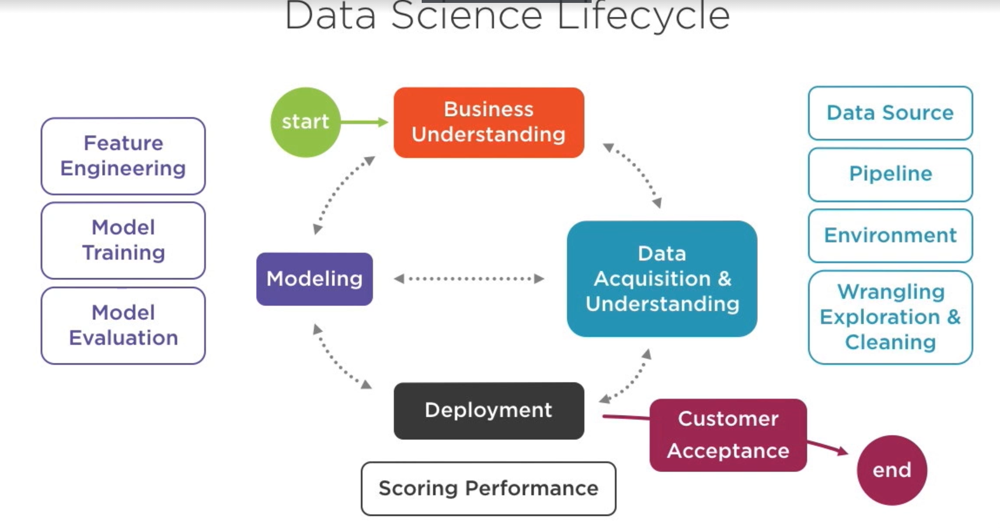

# How to start data science project on Azure

## Topics to cover: 
* Review current challenges implementing data science best practices
* Understanding benefits of TDSP-**Team Data Science Process**
* Review Resources provided as part of TDSP
* Create Azure M/c Learning Workspace
* Provision Compute Infra for Azure ML

### Data Science Challenges:

- Individuals coming from various backgrounds to solve business problems in data science, students from Computer Science, Data management expertise, Reserach Expertise, Mathematics and Stats etc. bring their own sets of best practices
- example: Best practice for CS - Version Control, CI/CD, Scrum Methodology( agile concepts on how team plan and do work ) 
- Data methodology/ Data Mining: CRISP(Cross Industry Standard Process) for data mining , KDD - Knowledge discovery in databases

##### Goal of Machine Learning Workspace
- To increase likelihood of producing actionable insights by leveraging  cross divisional best practices

- Microsoft has put together this in Team Data Science Process(TDSP) 

**TDSP**: 
- Agile, iterative data science methodology to deliver predictive analysis solutions, and intelligent applications efficiently. 
- Process for entier team to acheive these goals 

### TDSP Components

- Data Science Lifecycle : overall lifecycle from inception to completion
- Standarized Project Structure: stabdard structure with version control 
- infrastruture and resouce: provide by Azure Machine Learnign, TDSP is not specific to azure
- tools and Utilities: 

#### Data Science Lifecycle

- start with business understanding
- identify data sources -> develop pipeline and env -> wrangling and cleansing of data. So this is part of data acquisition and understanding data for model input. 
- then we will transition to modelling: here we're doing feature engineering, model training, model evaluation etc. 
- once we have modelling done then we're looking at deployment to be done. Here we are focusing on operationalization the stuff for learning we have gained till now. 
- Once we have high level of Confidence, finally we have customer acceptance in the end. 

#### Standarized Project Structure: 
- template available in github
- enables storage for all project assests of each phase in repo 
- includes tempaltes for standard project deliverables : Project Charter, model reports etc., model performance metrics

#### Infrastructure and Resouces 
- it helps with repropducible analysis
- avoid duplicacy, inconsistencies
- secure connection to resources 

##### Tools and Utilities
- also on github
- IDEAR( Interactive data exoploratory analysis and reporting) : R, Python etc
- AMAR( Automated Modelling and Reporting) in R

### TDSP Team Roles
- Project Lead <-> Data Scientis <-> Project Manager <-> Solution Architect

- More to be added 

