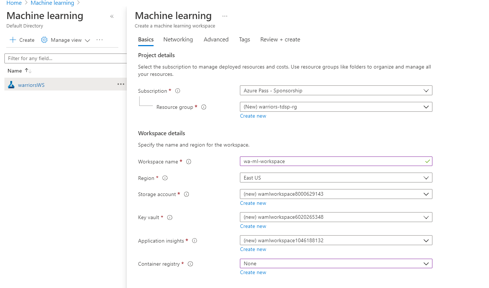
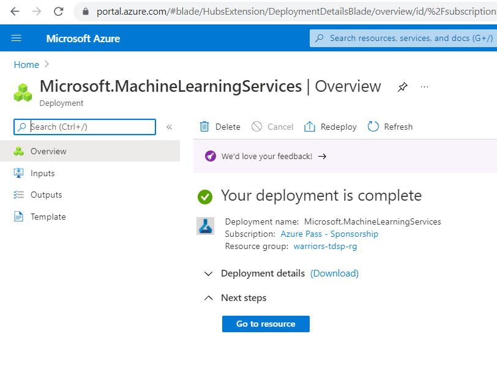
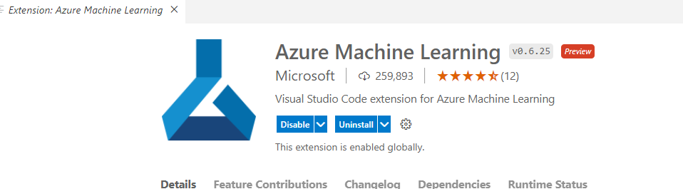
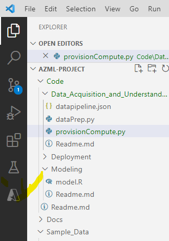
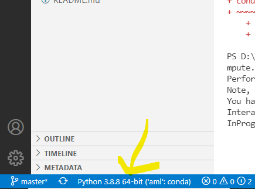
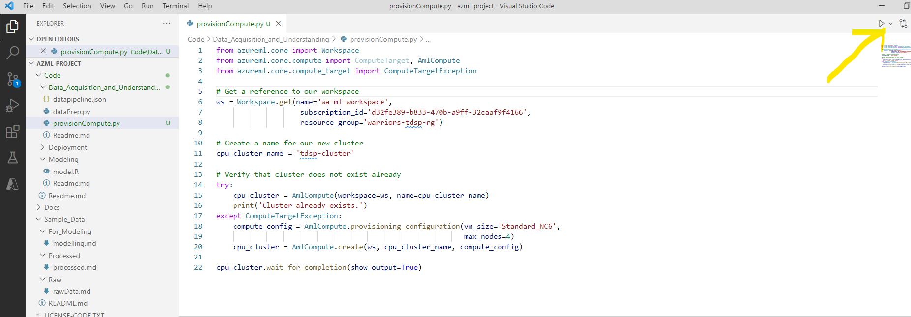
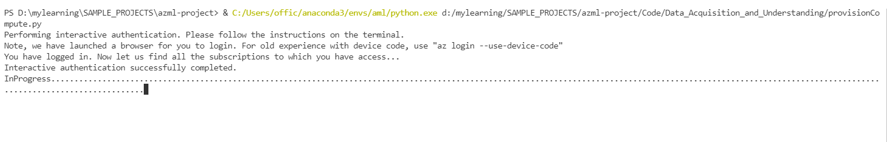
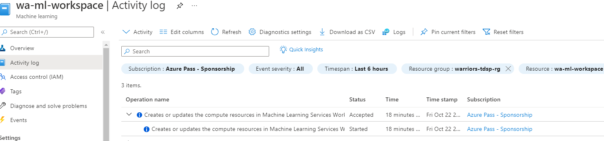
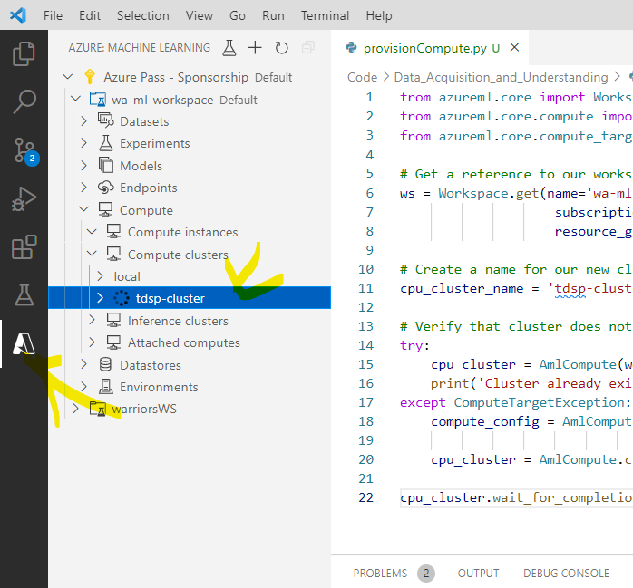

#DEMO

# Creating a TDSP Project

This clip will walk you through the process of creating a TDSP project, an Azure Machine Learning workspace, utilizing the SDK for Python, and provisioning compute resources.

## Notice

In this clip you will provision GPU supported compute resources.  If you do not decommission these instances (which will also be covered in this clip), you could incur a substantial cost.


## Preparation

To prepare for this clip, you will need to have a browser open with the following two tabs:

* [TDSP Project Template](https://github.com/Azure/Azure-TDSP-ProjectTemplate) (in Github)
* [Azure Portal](https://portal.azure.com/) (logged in to your account)

In addition, you need to have [Anaconda](https://www.anaconda.com/distribution/#download-section), [Git](https://git-scm.com/), and [VS Code](https://code.visualstudio.com/) already installed on your computer.

**Testing pre-requistes**: 

```text
search for anaconda terminal

(base) C:\Users\offic>conda -V
conda 4.10.1
```

```text
NitinJain@DESKTOP-N38RJ75 MINGW64 ~
$ git --version
git version 2.33.0.windows.2
```

```text
C:\Users\offic>code -v
1.61.1
c13f1abb110fc756f9b3a6f16670df9cd9d4cf63
x64
```

##### creating new environment for python using anaconda

> conda create -n aml python=3.8 anaconda

```text
conda create -n aml python=3.8 anaconda

#
# To activate this environment, use
#
#     $ conda activate aml
#
# To deactivate an active environment, use
#
#     $ conda deactivate
``` 

## Creating an Azure Machine Learning Workspace

- go to  https://portal.azure.com/
- Home -> Machine Learning 
- add resource group : warriors-tdsp-rg
- workspace name: wa-ml-workspace






##### Activate aml environment
> (base) C:\Users\offic>conda activate aml
>
>  (aml) C:\Users\offic>

### Clone the TDSP project template
> git clone https://github.com/Azure/Azure-TDSP-ProjectTemplate azml-project

```text
NitinJain@DESKTOP-N38RJ75 MINGW64 /d/mylearning/SAMPLE_PROJECTS
$ git clone https://github.com/Azure/Azure-TDSP-ProjectTemplate azml-project
Cloning into 'azml-project'...
remote: Enumerating objects: 164, done.
remote: Total 164 (delta 0), reused 0 (delta 0), pack-reused 164
Receiving objects: 100% (164/164), 57.28 KiB | 3.82 MiB/s, done.
Resolving deltas: 100% (57/57), done.

```

### Configure  VS Code to work with azure ML
```text
setup anaconda in path if conda command not working in vscode

C:\Users\offic\anaconda3\Library\bin
C:\Users\offic\anaconda3\
```


open VSCode as follows: 
```text
NitinJain@DESKTOP-N38RJ75 MINGW64 /d/mylearning/SAMPLE_PROJECTS
$ cd azml-project/

NitinJain@DESKTOP-N38RJ75 MINGW64 /d/mylearning/SAMPLE_PROJECTS/azml-project (master)
$ code .

```

- it will open project in VSCode
- Next, you will need to install the `Azure Machine Learning` extension for VS Code.  Navigate to the extensions tab and search for `Azure Machine Learning`.  Install the extension.



### Provision Compute Resources in Azure ML from the python SDK

- click on azure here to login to azure portal from vscode


- add azureml-sdk package via conda command prompt
```text
conda install pip
pip install azureml-sdk
```

- now create file provisionCompute.py with given code amd modify it to add our resource group and subscription id. 

- make sure our python envirnment - aml is selected else change it to **aml**



- run  the code as follows: ( this will create gpu compute for us)



- it will open terminal as follows:



- can check on azure portal for progress:


- This will create a cluster with up to 4 ND-series instances (which utilize 1 NVIDIA Tesla K80 GPU). More details [here](https://docs.microsoft.com/en-us/azure/virtual-machines/nc-series)

- we can verify it here: 



### Decommission Compute Resources in azure ML from the python SDK

- similarly added Code\Data_Acquisition_and_Understanding\decommissionCompute.py script to decommission the compute resources for our workspace 
- 
