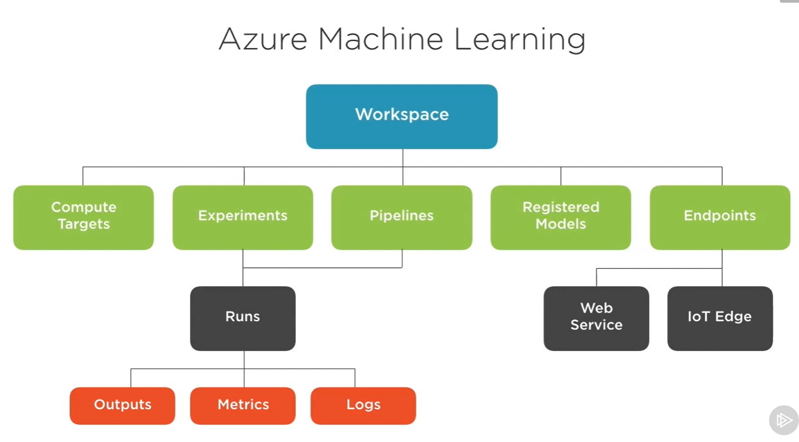

# Azure ML Workflow

## Capabilities of Azure ML:
- Register Data
- Perform experiences - to validate our hypothesis for creating model  
- evaluating and storing models 
- deploy models 

### Register Data 
- both public and private data
- reusable pipeline for data prep
- tools to pull data to Azure and outside azure

### Perform Experiments 
- leverage both cpu and gu
- dynamic scaling of infra
- support ml frameworks
- customization

### Evaluate and Store Moidels 

- provides model storage
- store model from local experimentation or on compute cluster 
- do experientments locally and upload your model

### Deploy Models
- zero code deployment
- any framework supported
- python SDK or rest based endpoint available
- supports Azure Kubernetes Service

## Azure ML Workspace:

- Workspace consits of following Components: Compute Targets( local or remote) , Experiments ( to test our hypothesis) Pipelines, RRegistered Models, Endpoints( to depoy)
- Under Experiments we have Runs( individual passes of single experiment )which will produce outputs, metrics and logs
- Pipeline also feed data to Runs 
- endpoints - web service endpoints 

## Interating with Azure ML

- IDE & CLI
- Browser
- Jupyter Notebook

- Azure ML has two interfaces: 
1. via azure portal providing management functionality
2. via Azure learning studio for advanced tooling