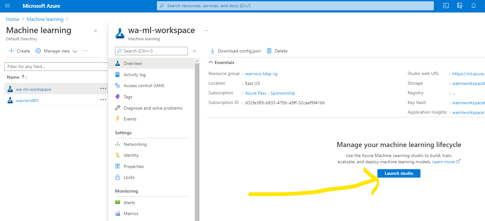
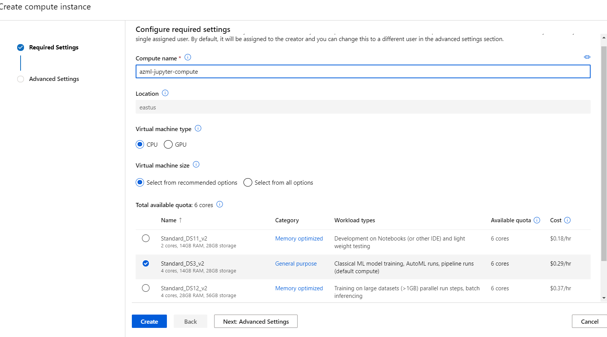
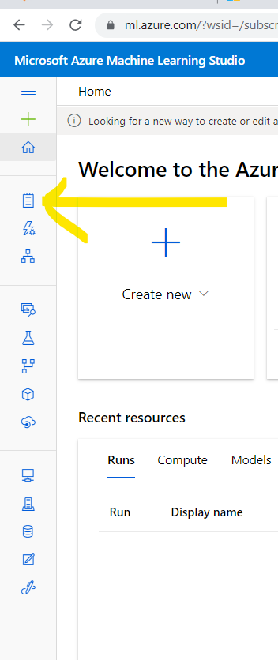
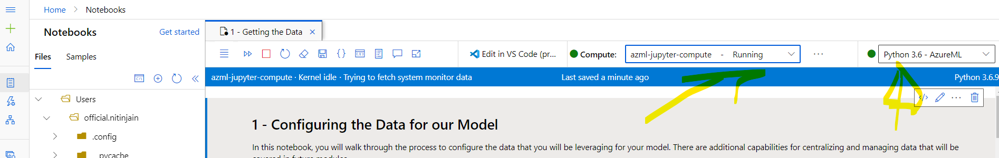

# Launching a Notebook Server

## launch machine learning studio

- create compute that we require running notebook

- open notebook from here:

- upload files from [here](exercise_files/03)
- note the compute and python version allocated:

- Thus we can work on Azure Notebook with our own compute engine

